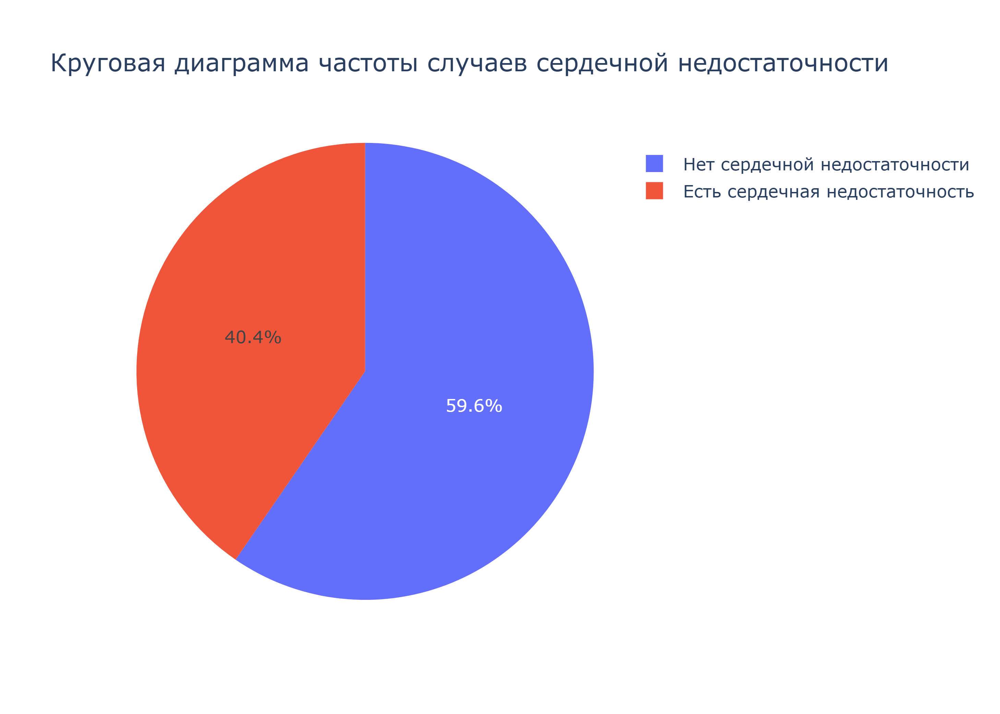
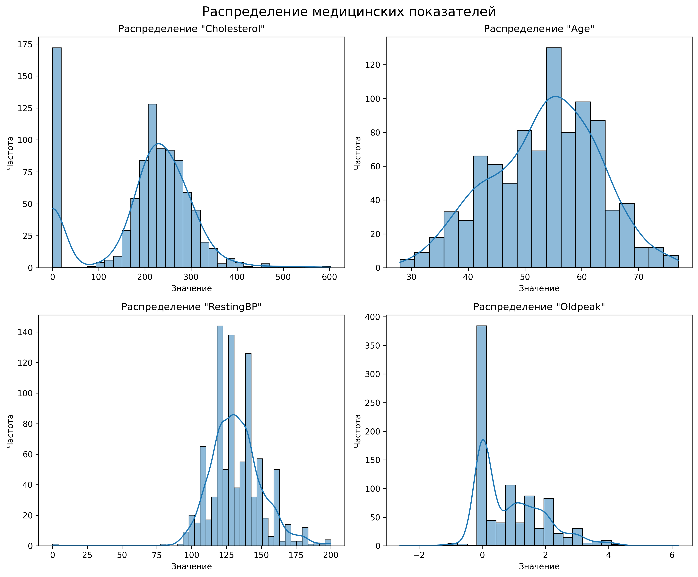
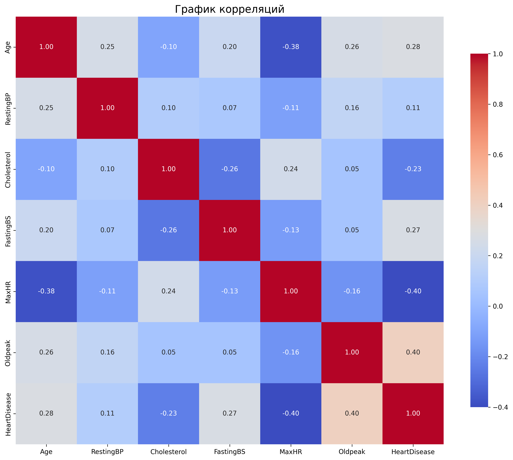
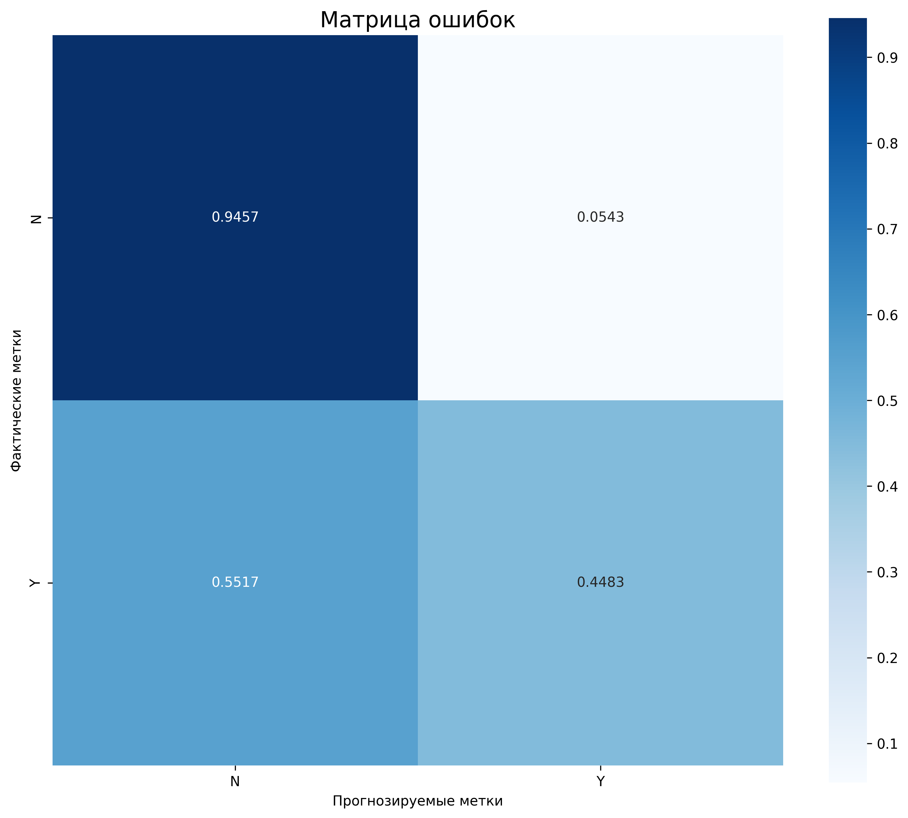
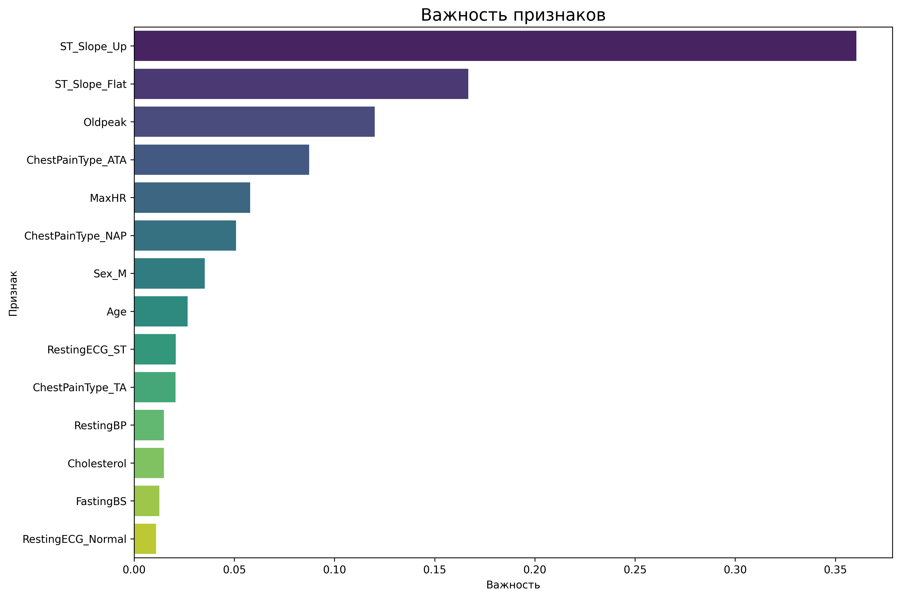

# Система предсказания сердечной недостаточности

Профессиональная система машинного обучения для предсказания риска сердечной недостаточности на основе медицинских показателей пациентов.

## 📋 Описание проекта

Данный проект представляет собой решение для бинарной классификации риска сердечной недостаточности. Система анализирует медицинские показатели пациентов и предсказывает наличие сердечной недостаточности с использованием ансамблевых методов машинного обучения.

## 🎯 Возможности системы

- **Анализ медицинских данных**: Обработка и визуализация различных медицинских показателей
- **Предсказание риска**: Использование двух ансамблевых моделей (Random Forest и XGBoost)
- **Визуализация данных**: Графики распределения, корреляционные матрицы, матрицы ошибок
- **Оценка качества**: Подробные метрики классификации
- **Тестовое прогнозирование**: Возможность тестирования на отдельных примерах

## 📊 Графики и визуализации

Все графики автоматически сохраняются в папку `results/plots/` при запуске скрипта обучения. Графики Plotly настроены на сохранение в статические изображения (PNG) без открытия в браузере.

### Доступные графики

| Файл | Описание |
|------|----------|
| `results/plots/pie_chart.png` | Круговая диаграмма распределения целевой переменной |
| `results/plots/distributions.png` | Гистограммы распределения числовых признаков |
| `results/plots/correlation_matrix.png` | Тепловая карта корреляций признаков |
| `results/plots/confusion_matrix.png` | Матрица ошибок классификации |
| `results/plots/feature_importance.png` | Важность признаков модели XGBoost |

### 1. Круговая диаграмма частоты случаев сердечной недостаточности

Диаграмма показывает распределение случаев сердечной недостаточности в датасете:
- **Нет сердечной недостаточности (N)**: 547 случаев (59.6%)
- **Есть сердечная недостаточности (Y)**: 371 случай (40.4%)



### 2. Распределение медицинских показателей

Графики показывают распределение ключевых медицинских показателей:
- **Cholesterol** - уровень холестерина (среднее: 198.80, std: 109.38)
- **Age** - возраст пациентов (среднее: 53.51, std: 9.43)
- **RestingBP** - артериальное давление в покое (среднее: 132.40, std: 18.51)
- **Oldpeak** - ST-сегмент (среднее: 0.89, std: 1.07)



### 3. Корреляционная матрица

Тепловая карта корреляций между числовыми признаками помогает выявить взаимосвязи между медицинскими показателями.



### 4. Матрица ошибок (Confusion Matrix)

Визуализация результатов классификации модели XGBoost. Показывает количество верных и ошибочных предсказаний для каждого класса.



### 5. Важность признаков

График показывает наиболее значимые признаки для предсказания сердечной недостаточности согласно модели XGBoost.



## 📈 Результаты моделирования

### Точность моделей

| Модель | Точность на обучении | Точность на тесте |
|--------|---------------------|-------------------|
| Random Forest | 87.42% | 78.00% |
| XGBoost | 77.52% | 75.33% |

### Детальные результаты

**Random Forest:**
- Точность на обучающей выборке: 87.42%
- Точность на тестовой выборке: 78.00%
- Параметры: 100 деревьев, глубина 5
- Сохранена в: `results/models/random_forest.joblib`

**XGBoost:**
- Точность на обучающей выборке: 77.52%
- Точность на тестовой выборке: 75.33%
- Параметры: 100 деревьев, скорость обучения 0.01, глубина 3
- Сохранена в: `results/models/xgboost.joblib`

### Характеристики датасета

- **Всего сэмплов**: 918
- **Всего признаков**: 12
- **Обучающая выборка**: 596 сэмплов (80%)
- **Тестовая выборка**: 150 сэмплов (20%)
- **Распределение целевой переменной**:
  - Нет сердечной недостаточности (N): 547 случаев (59.6%)
  - Есть сердечная недостаточность (Y): 371 случай (40.4%)

### Анализ важности признаков

На основе модели XGBoost были выявлены наиболее значимые признаки для предсказания сердечной недостаточности:
1. **ST_Slope** - наклон ST-сегмента
2. **ChestPainType** - тип боли в груди
3. **Oldpeak** - ST-сегмент
4. **MaxHR** - максимальная частота сердечных сокращений
5. **Age** - возраст пациента

### Выводы по результатам

1. **Обе модели показали хорошие результаты** с точностью выше 75%
2. **Random Forest** демонстрирует более высокую точность на обучающей выборке, что может указывать на переобучение
3. **XGBoost** показывает более стабильные результаты на тестовой выборке
4. **Важные признаки** согласуются с медицинской практикой (ST-сегмент, тип боли, возраст)
5. **Рекомендация**: Для продакшена рекомендуется использовать XGBoost из-за лучшей стабильности

## 🏗️ Структура проекта

```
heart_failure_detection_system/
├── README.md                          # Основная документация
├── requirements.txt                   # Зависимости проекта
├── .gitignore                        # Игнорируемые файлы Git
├── config/
│   └── settings.py                   # Конфигурационные параметры
├── src/
│   ├── __init__.py
│   ├── data_loader.py                # Загрузка и подготовка данных
│   ├── data_preprocessor.py          # Предобработка данных
│   ├── models/
│   │   ├── __init__.py
│   │   ├── base_model.py             # Базовый класс модели
│   │   ├── random_forest_model.py    # Модель Random Forest
│   │   └── xgboost_model.py          # Модель XGBoost
│   ├── visualization/
│   │   ├── __init__.py
│   │   └── visualizer.py             # Визуализация данных
│   └── utils/
│       ├── __init__.py
│       └── helpers.py                # Вспомогательные функции
├── notebooks/
│   └── analysis.ipynb                # Jupyter notebook для анализа
├── scripts/
│   └── train.py                      # Скрипт для обучения моделей
├── data/
│   └── heart.csv                     # Исходные данные
└── results/
    ├── models/                       # Сохраненные модели
    └── plots/                        # Сохраненные графики
```

## 🚀 Установка и использование

### 1. Установка зависимостей

```bash
pip install -r requirements.txt
```

### 2. Подготовка данных

Данные должны находиться в папке `data/heart.csv`. Если файла нет, он будет автоматически загружен из Kaggle.

### 3. Запуск обучения моделей

```bash
python scripts/train.py
```

### 4. Использование в коде

```python
from src.data_loader import DataLoader
from src.data_preprocessor import DataPreprocessor
from src.models.random_forest_model import RandomForestModel
from src.models.xgboost_model import XGBoostModel
from src.visualization.visualizer import Visualizer

# Загрузка данных
loader = DataLoader()
df = loader.load_data()

# Предобработка
preprocessor = DataPreprocessor()
x_processed, y = preprocessor.preprocess(df)

# Обучение моделей
rf_model = RandomForestModel()
rf_model.train(x_processed, y)

xgb_model = XGBoostModel()
xgb_model.train(x_processed, y)

# Визуализация
visualizer = Visualizer()
visualizer.plot_distributions(df)
visualizer.plot_correlation_matrix(df)
```

## 📋 Требования

- Python 3.8+
- pandas
- numpy
- scikit-learn
- xgboost
- plotly
- kaleido (для сохранения графиков в изображения)
- matplotlib
- seaborn

## 🎓 Методы машинного обучения

### Random Forest
- **Количество деревьев**: 100
- **Максимальная глубина**: 5
- **Случайное состояние**: 20

### XGBoost
- **Количество деревьев**: 100
- **Скорость обучения**: 0.01
- **Максимальная глубина**: 3
- **Доля признаков**: 0.2
- **Объектив**: binary:logistic

## 📊 Метрики оценки

- **Accuracy** - точность классификации
- **Precision** - точность предсказания положительного класса
- **Recall** - полнота обнаружения положительного класса
- **F1-score** - гармоническое среднее precision и recall
- **Confusion Matrix** - матрица ошибок классификации

## 🔬 Анализ данных

### Признаки датасета

1. **Age** - возраст пациента (лет)
2. **Sex** - пол (M/F)
3. **ChestPainType** - тип боли в груди (TA/ATA/NAP/ASY)
4. **RestingBP** - артериальное давление в покое (mm Hg)
5. **Cholesterol** - уровень холестерина (mm/dl)
6. **FastingBS** - уровень сахара натощак (1: >120 mg/dl, 0: иначе)
7. **RestingECG** - результат электрокардиограммы в покое (Normal/ST/ LVH)
8. **MaxHR** - максимальная частота сердечных сокращений
9. **ExerciseAngina** - стенокардия при физической нагрузке (Y/N) - **целевая переменная**
10. **Oldpeak** - ST-сегмент (числовое значение)
11. **ST_Slope** - наклон ST-сегмента (Up/Flat/Down)

## 🤝 Вклад в проект

Для внесения изменений в проект:

1. Форкните репозиторий
2. Создайте ветку для новой функции (`git checkout -b feature/new-feature`)
3. Сделайте коммит изменений (`git commit -m 'Add new feature'`)
4. Запушите ветку (`git push origin feature/new-feature`)
5. Создайте Pull Request

## 📄 Лицензия

MIT License

## 📧 Контакты

Проект разработан в образовательных целях.

---

**Статус проекта**: ✅ Готов к использованию